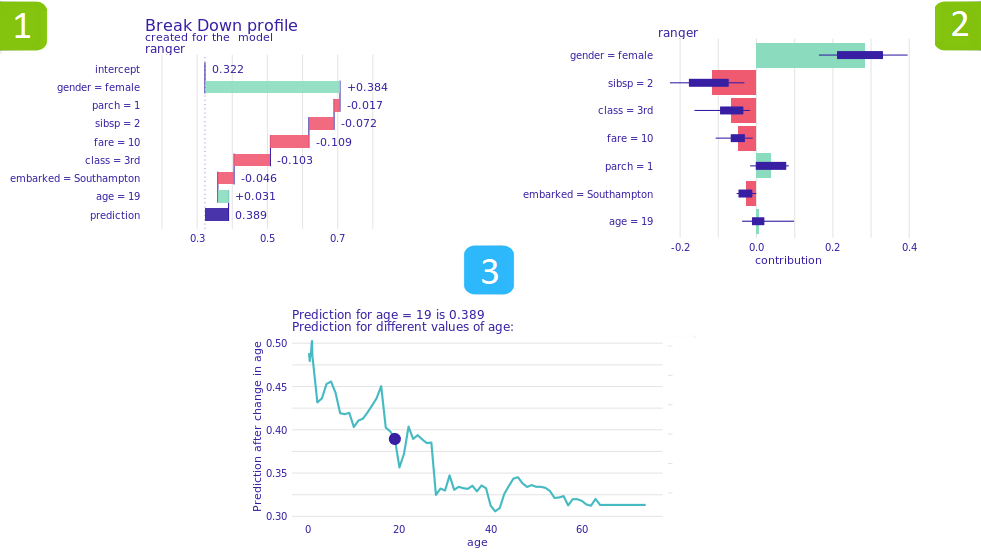
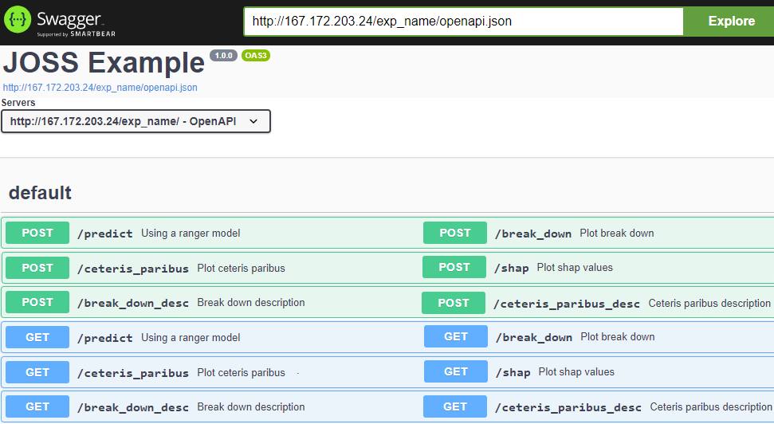

# Introduction

Machine learning models are utilized in nearly every field of science and business. One of the most discussed topics lately has been the linkage between the model's utility and it's explainability. With the arising interest in explainable artificial intelligence many Interpretable Machine Learning tools emerged. Among the most outstanding solutions DALEX [@Biecek:2018], The What-If Tool [@Wexler:2019] and shap [@Lundberg:2017] should be mentioned.

Humans process visual data better than raw numbers [@Alexandra:2010]. The whole goal of creating explainable models is to present the decision-making process and distinctly interpret the results. Thankfully some tools enable data scientists to visualize their results. DrWhy.AI repository consists not only of previously mentioned DALEX but also demonstration solutions like ingredients [@Biecek:2020], iBreakDown [@Gosiewska:2019] and modelStudio [@Baniecki:2019].

In conclusion there are solutions available that meet all the requirements for a data scientist to explain his model. The only issue is sharing those results. Models in the form of R objects cannot be attached to a report or presented during the project's workflow. Steps have been taken to combat this problem by the archivist [@Archivist:2017] R package. It enables storing inactive R object along with meta-data. There is a way to enhance this process and enable predictive models to be turned into an autonomous module working in the cloud.

# The xai2cloud package

The xai2cloud R package automates the process of deploying the predictive model's results into a cloud-based RESTful application. The solution is built on top of the plumber [@Plumber:2020] and analogsea [@Analogsea:2020] R packages. Those tools combined with the use of DrWhy.AI [@DrWhy:2020] explainable AI solutions result in a complete appliance for sharing R models. 

Despite cloud-based solutions being commonly associated with setup difficulty and high entry threshold, xai2cloud is created with simplicity in mind. Configuration of the cloud environment is a one-time activity that is thoroughly explained at the package's [website](https://modeloriented.github.io/xai2cloud/). 

The solution used for cloud computing is [DigitalOcean](https://www.digitalocean.com/). The platform is affordable and presents an intuitive website interface to keep track of all currently running droplets. Droplet is a name given by DigitalOcean for their Linux servers running on top of cloud-based hardware. Configuration of a new server is done entirely through R using the setup feature of the xai2cloud package which creates a new droplet with R version 3.6.3 and all the essential packages already installed.

After the initial setup the deployment process is instant and intuitive. The package can deploy any model wrapped into an explainer with one R function. Explainers are adapters available for predictive models created using the DALEX package. This allows for sharing work progress on the run.

# Deployment example

The xai2cloud R package can be installed from GitHub using devtools with:

`devtools::install_github('ModelOriented/xai2cloud')`

Droplet setup is requisite to start working with model deployment using xai2cloud. The quick setup guide is available at the package's [website](https://modeloriented.github.io/xai2cloud/). Assuming the configuration has been completed, the deployment of any predictive models is rapid and effortless. Below is a code sample attached which produces an [example](http://167.172.203.24/exp_name/__swagger__/).

```r
# Create a model
model <- glm(survived~., data = titanic_imputed, family = "binomial")

# Wrap it into a DALEX explainer
library(DALEX)
exp_name <- explain(model, data = titanic_imputed[,-8], y = titanic_imputed$survived)

# Check droplet's ID
library(analogsea)
my_droplets <- droplets()
# Choose the correct droplets name - 'xai2cloudExamples' in this case
specific_droplet <- my_droplets$xai2cloudExamples
droplet_id <- specific_droplet$id

# Deploy the explainer to the selected droplet
library(xai2cloud)
deploy_explainer(exp_name, model_package = 'stats',
                 droplet=droplet_id, port=8080, title="JOSS Example")
```


# Features overview

The deployed explainer is active as an application compliant to the representational state transfer architecture @REST:2000 operating on the droplet's server. It hosts five post and get hooks in total enabling the user to explore the model and its predictions. The features provided include not only a basic prediction of inputted data but also local model explanations:



* Break Down [@Breakdown:2018] plots \autoref{fig:plots} present the contribution of each variable to the prediction. There are two hooks associated with this feature, one creates the plot and returns it as an image, the other one is a description consisting of crucial information that can be gathered from the Break Down plot \autoref{fig:example} and is returned as a string.

* Ceteris Paribus @Biecek:2018 plots \autoref{fig:plots} from the Ingredients R package present model responses around a single point in the feature space. It enables the user to view possible changes in model predictions allowing for changes in a single variable while keeping all other features constant. The results are also available as both a plot and a text description summing up crucial conclusions.

# Usage



The application created by xai2cloud can be utilized in various ways. There is a built-in Swagger User Interface \autoref{fig:swagger} available at the droplet's server. Swagger is a set of open-source tools that enhance REST application building process. One of the tools available is Swagger UI which presents an interactive API documentation. Therefore it can be used as a basic standalone solution for sharing predictive models results. The opportunities created by this solution however allow for use in much more complex projects. The ability granted by xai2cloud to deploy multiple models on one droplet without any further configuration enables the users to create applications gathering model data from the whole organization. The package is built in a way to encourage using it as an external data source for projects concerning predictive modeling.

# Summary

The xai2cloud package offers a new perspective on sharing the predictive model's results. It enables cloud deployment of artificial intelligence solutions while reducing the setup technological entry threshold to the minimum. Enabling users to view and understand the predictive model is the end goal of explainable artificial intelligence. This objective can be achieved using built-in local explanation features and plots from the xai2cloud package. The package is in constant development and the features list is going to expand over time. Updates and more examples can be found on [GitHub repository](https://github.com/ModelOriented/xai2cloud) of the project and on the [corresponding website](https://modeloriented.github.io/xai2cloud/).


# Acknowledgements


# References